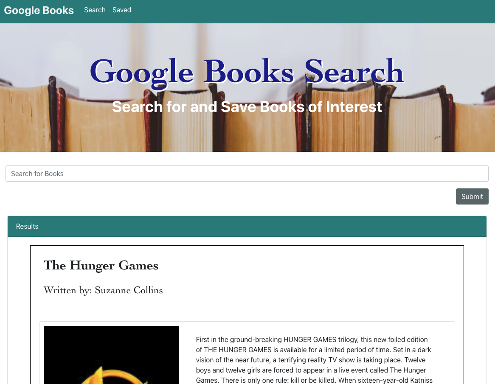

# Google Books Search
Coding Bootcamp Unit 20: React

### Heroku Deployment
https://google-books-search-project.herokuapp.com/

#### Description:
Google Books Search application is a React-based application utilizing the full MERN stack allowing users to search for book titles via the Google Books API then save books for future reference and providing a link to purchase.

Once the user returns a list of books based on their search criteria, simply hit the "save" button to save it to the database for future reference.  On either the search results or in the list of saved book, click the "View" button to view the book on the google books website for further information or to purchase.

#### Technology Used:
- Front-end: Bootstrap with React (a Single-Page_app including the use of react-router-dom)
- Back-end: Nodejs/Express/Mongoose
- Database: MongoDB

App screenshot
